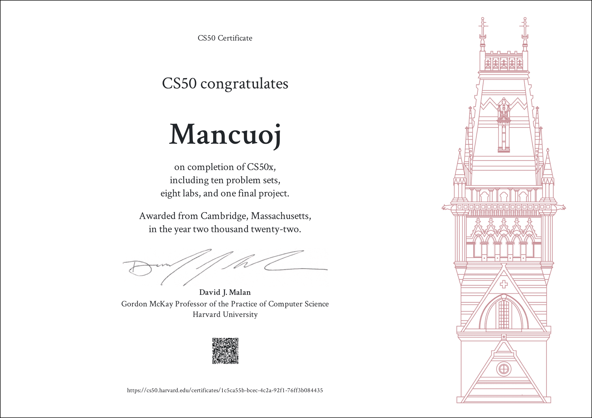

 

<h1 align="center">
Harvard CS50x — 2022
</h1>

  <a href="https://cs50.harvard.edu/x/2022/">Course Link</a> |
  <a href="https://pset8.netlify.app/">PSet 8</a> | 
  <a href="https://github.com/mancuoj/watchlist">Final Project</a> |
  <a href="https://github.com/mancuoj/CS50P">CS50P</a>

## Works

<pre align="center">
For Reference Only
</pre>

Leave only the file that needs to be modified for each assignment.

Click into the folder to view the weekly assignments and my completion.

Finished on 22/07/13, and the next stop is [CS61A](https://github.com/mancuoj/CS61A).

